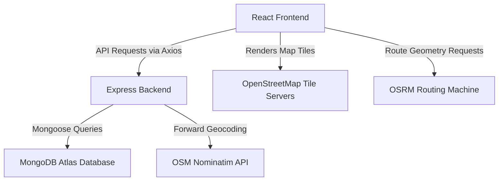
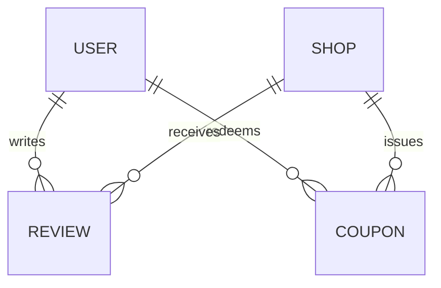

# ChaiSpot 🍵
> **Chai Shop Discovery & Rewards Platform**

A complete MERN stack application allowing users to register and discover local chai shops, view them on an interactive open-source map, calculate driving routes, submit reviews, and earn reward points redeemable for coupon codes.

---

## 🚀 Project Overview

ChaiSpot connects chai enthusiasts with local vendors. It operates on an entirely open-source mapping stack (**MapLibre GL JS**, **OpenStreetMap**, **Nominatim**, and **OSRM**), completely eliminating the need for proprietary Mapbox keys. It implements robust secure JWT authentication, server-side address geocoding, transactional point allocations, and atomic coupon redemption workflows.

---

## 🛠️ Tech Stack & Architecture

### Tech Stack Summary
* **Frontend**: React (Vite), React Router, Axios, MapLibre GL JS
* **Backend**: Node.js, Express, MongoDB, Mongoose, Express Validator
* **Authentication**: JSON Web Token (JWT), bcryptjs
* **Mapping Tiles**: OpenStreetMap Raster Tiles
* **Geocoding Service**: OpenStreetMap Nominatim API
* **Routing Machine**: OSRM (Open Source Routing Machine) API

### Architecture Choices & Rationales



1. **Vite + React**: Chosen for fast dev bundling and optimal production compilations, reducing initial load latencies.
2. **Express & Node.js**: High-concurrency event-loop model yields highly scalable RESTful services.
3. **MongoDB Atlas**: Standard document-store database. GeoJSON coordinate standard indices (`2dsphere`) allow quick geographic queries.
4. **MapLibre GL JS**: Open-source fork of Mapbox GL. Standard MapLibre canvas allows compiling fully custom maps without locking developers into proprietary, paid Mapbox licensing.
5. **OpenStreetMap Raster Tiles**: Clean, free-to-use, community-maintained maps.
6. **Nominatim geocoding**: Safe, user-agent validated query endpoints to geocode start and shop addresses on the server side.
7. **OSRM (Open Source Routing Machine)**: Calculates driving route steps and outputs GeoJSON geometries to render paths between start and end markers on the map canvas.

---

## 🗄️ Database Schemas & Data Model

We define four primary collections with key relationships:



### 1. User Schema (`User.js`)
* Stores user credentials. Passwords are encrypted before saving using `bcryptjs` (via pre-save hooks).
* **Fields**: `email` (string, unique), `password` (string), `points` (number, default 0).
* **Serialization safety**: Password hashes are automatically omitted from all JSON serialization outputs.

### 2. Shop Schema (`Shop.js`)
* Stores geocoded shop entities.
* **Fields**: `name` (string), `address` (string), `description` (string), `photoUrl` (string), `location` (GeoJSON Point: `coordinates: [longitude, latitude]`), `averageRating` (number, default 0), `reviewCount` (number, default 0), `createdBy` (ObjectId referencing User).
* **Indices**: A spatial `2dsphere` index is declared on `location` to handle geo-queries.

### 3. Review Schema (`Review.js`)
* Enforces rating scorecards.
* **Fields**: `userId` (ObjectId referencing User), `shopId` (ObjectId referencing Shop), `rating` (integer, 1 to 5), `text` (string, max 500 characters).
* **Unique constraint**: A compound unique index `{ userId: 1, shopId: 1 }` is enforced at the database layer, guaranteeing users can only post one review per shop.

### 4. Coupon Schema (`Coupon.js`)
* Handles platform point redemptions.
* **Fields**: `userId` (ObjectId referencing User), `shopId` (ObjectId referencing Shop), `code` (string, unique), `pointsSpent` (number, default 50), `status` (string, enum: `ACTIVE`, `USED`, `EXPIRED`, default `ACTIVE`).

---

## 🔌 API Documentation

All request payloads and error boundaries return consistent JSON formats.

### Authentication Endpoints
| Method | Endpoint | Purpose | Auth Required |
| :--- | :--- | :--- | :---: |
| `POST` | `/api/auth/signup` | Registers new user profile | No |
| `POST` | `/api/auth/login` | Authenticates and returns JWT token | No |
| `GET` | `/api/users/me` | Fetches active authenticated user profile | Yes |

### Shop Endpoints
| Method | Endpoint | Purpose | Auth Required |
| :--- | :--- | :--- | :---: |
| `POST` | `/api/shops` | Creates a new geocoded shop | Yes |
| `GET` | `/api/shops` | Lists all registered shops | No |
| `GET` | `/api/shops/:id` | Fetches a single shop's details | No |
| `GET` | `/api/shops/geocode` | Geocodes starting address via Nominatim | No |

### Review Endpoints
| Method | Endpoint | Purpose | Auth Required |
| :--- | :--- | :--- | :---: |
| `POST` | `/api/shops/:shopId/reviews`| Post or update review for a shop | Yes |
| `GET` | `/api/shops/:shopId/reviews` | Retrieve all reviews for a shop | No |
| `GET` | `/api/reviews/me` | Fetch reviews written by current user | Yes |

### Reward & Coupon Endpoints
| Method | Endpoint | Purpose | Auth Required |
| :--- | :--- | :--- | :---: |
| `POST` | `/api/rewards/redeem` | Redeems 50 points for a unique coupon | Yes |
| `GET` | `/api/users/me/points` | Retrieves current point balance | Yes |
| `GET` | `/api/users/me/coupons` | Fetches user coupon history | Yes |

---

## 📁 Project Structure

```
ChaiSpot/
├── client/                 # React Frontend
│   ├── public/
│   ├── src/
│   │   ├── components/     # Reusable components (MapView, ShopCard, etc.)
│   │   ├── context/        # React Context (AuthContext)
│   │   ├── pages/          # Page Containers (Login, Rewards, MapPage)
│   │   ├── services/       # Client services (api, mapService, routingService)
│   │   ├── App.jsx
│   │   ├── index.css
│   │   └── main.jsx
│   ├── .env.example
│   ├── package.json
│   └── vite.config.js
└── server/                 # Express Backend
    ├── src/
    │   ├── config/         # Database configs
    │   ├── controllers/    # API controllers
    │   ├── middleware/     # Auth & error middlewares
    │   ├── models/         # Mongoose models (User, Shop, Review, Coupon)
    │   ├── routes/         # Router mounts
    │   ├── services/       # Business helpers (reviewService, locationService)
    │   ├── utils/          # Code utilities (couponGenerator)
    │   ├── validators/     # Express-validators (shopValidator, rewardValidator)
    │   └── app.js
    ├── .env.example
    ├── index.js
    └── package.json
```

---

## 🛠️ Local Installation & Setup

### Prerequisites
- Node.js (v16 or higher)
- MongoDB Atlas account (free tier)

### 1. Clone & Install Dependencies
```bash
git clone https://github.com/Abhav04/Chaispot.git
cd ChaiSpot

# Install backend dependencies
cd server && npm install

# Install frontend dependencies
cd ../client && npm install
```

### 2. Configure Environment Variables
Copy `.env.example` in both folders and fill in values:

* **Backend (`/server/.env`)**:
  ```env
  PORT=5001
  MONGO_URI=mongodb+srv://<user>:<password>@<cluster>.mongodb.net/chaispot
  JWT_SECRET=your_jwt_secret_key
  NODE_ENV=development
  ```
* **Frontend (`/client/.env`)**:
  ```env
  VITE_API_URL=https://chaispot-fgfp.onrender.com
  ```

### 3. Run Locally
* **Start Backend Server**:
  ```bash
  cd server && npm run dev
  ```
* **Start Vite Frontend Server**:
  ```bash
  cd client && npm run dev
  ```
* Open `http://localhost:5173` in your browser.

---

## 🌐 Production Deployment Guide

### Database (MongoDB Atlas)
1. Set up a free-tier cluster in MongoDB Atlas.
2. Under "Network Access", allow access from `0.0.0.0/0` (or compile IP bounds).
3. Copy the cluster connection URI and save it as your environment variable `MONGO_URI`.

### Backend (Render Deployment)
1. Connect your repository on Render and create a new **Web Service**.
2. Root directory: `server`.
3. Build Command: `npm install`.
4. Start Command: `npm start` (runs `node index.js`).
5. In **Environment Variables**, define `MONGO_URI`, `JWT_SECRET`, `NODE_ENV=production`, and `PORT=5001`.

### Frontend (Vercel Deployment)
1. Add a new project on Vercel and link your repository.
2. Root directory: `client`.
3. In **Environment Variables**, configure `VITE_API_URL` pointing to the deployed Render API (e.g. `https://chaispot-backend.onrender.com/api`).
4. Click **Deploy**.

---

## 🚫 Known Limitations & Future Scope

### Known Limitations
* **No Admin Dashboard**: Shops and coupon codes can only be queried through the regular interfaces.
* **No Image Upload**: Shop photo URLs must be provided manually as online links.
* **No Offline support**: Map tiles and OSRM routing require a persistent internet connection.
* **No Email Verification**: Accounts are activated immediately upon signup.

### Future Scope
* Implement shop search filters (proximity and average ratings).
* Integrate Cloudinary API for direct shop photo uploads.
* Build user points leaderboards.
* Implement verification logic to set coupon status to `USED` on code usage.

---

## 🎬 Screen Walkthrough Script (2-3 Minutes)

* **Intro (0:00 - 0:15)**: 
  *"Hi, today I'm demonstrating ChaiSpot, a platform for chai shop discovery and rewards. First, let's register a new user or log in. I'll log in with my existing account."*
* **Create Shop (0:15 - 0:45)**:
  *"Now, let's register a new shop. I'll click 'Add Shop' and fill in the name, description, and address. When I hit submit, the backend geocodes the address using Nominatim, converting it to GeoJSON coordinates and saving it directly to MongoDB Atlas."*
* **Interactive Map & Directions (0:45 - 1:15)**:
  *"Next, let's view the map page. All shops are rendered as red markers on OpenStreetMap raster tiles using MapLibre GL. Clicking a marker reveals the details popup. Let's get driving directions. I can select 'Current Location' or type a start point. Let's type 'Mumbai'. OSRM instantly generates the routing track, rendering a blue vector path and auto-fitting the map view bounds."*
* **Write Review (1:15 - 1:45)**:
  *"Let's head to the Shop Details page to submit a review. Since this is a new shop and this will be its first review, I'll submit a rating of 5 stars. Submitting it immediately recalculates the shop's average score and count on the dashboard, and awards me 15 points."*
* **Review Edit (1:45 - 2:00)**:
  *"If I decide to edit my review to 4 stars, the system updates the review in-place, satisfying our database-level unique constraints. The points balance remains unchanged, ensuring users only earn points for initial reviews."*
* **Rewards Coupon (2:00 - 2:30)**:
  *"Lastly, let's check the Rewards page. I now have enough points. I will select my shop and click 'Redeem Coupon'. The backend atomically decrements 50 points and generates the coupon code `CHAI-XXXXXX`, updating the active history dashboard. Thank you!"*

---

## 🌍 Live Application

| | URL |
|---|---|
| **Frontend (Vercel)** | [https://chaispot-eta.vercel.app](https://chaispot-eta.vercel.app) |
| **Backend API (Render)** | [https://chaispot-fgfp.onrender.com/api/health](https://chaispot-fgfp.onrender.com/api/health) |
| **GitHub Repository** | [https://github.com/Abhav04/Chaispot](https://github.com/Abhav04/Chaispot) |
